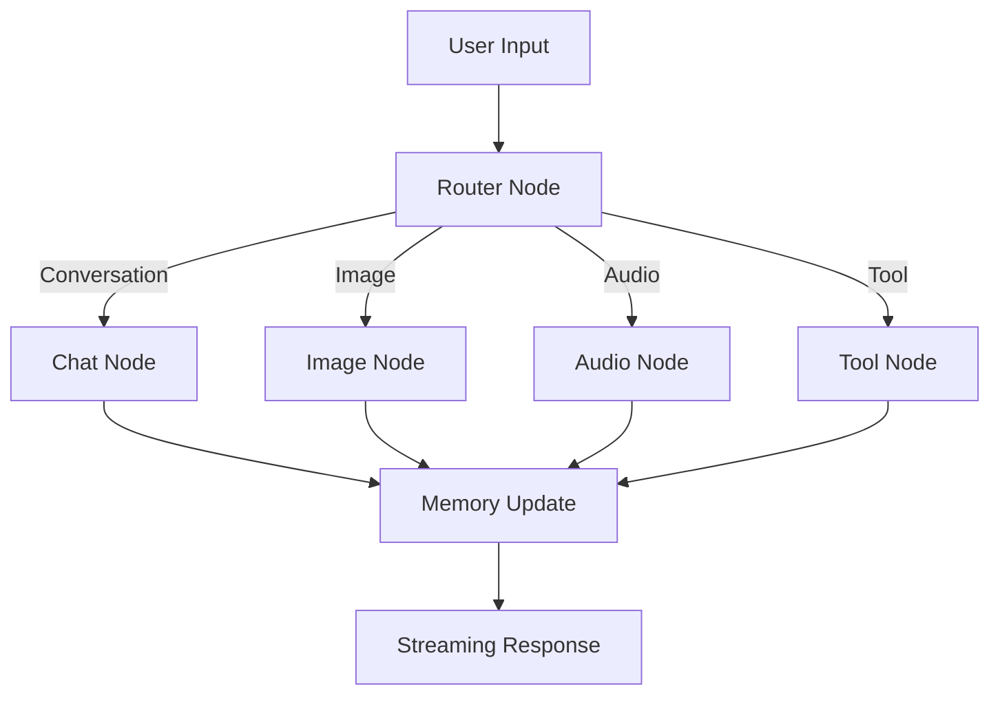

# 🧠 Ava AI Companion

<p align="center">
  <b>A multi-modal, memory-powered AI assistant built using LangGraph</b><br>
  <i>Designed to simulate a real AI companion with memory, tools, and intelligent workflows</i>
</p>

---

<p align="center">
  
  
  
  
  
</p>

---

## 🌟 What is Ava?

**Ava** is not just a chatbot — it is a **stateful AI assistant** that:

- Remembers users across conversations 🧠  
- Adapts responses using memory + personality 🎭  
- Uses tools to interact with real-world data 🌐  
- Generates images and speech 🎨🔊  
- Streams responses in real-time ⚡  

> Built to demonstrate **modern AI system design**, not just prompt engineering.

---

## 🚀 Core Capabilities

### 🧠 Persistent Memory System
- Long-term memory using **Qdrant (Vector DB)**
- Stores:
  - User identity
  - Preferences
  - Behavioral patterns
- Features:
  - Importance scoring (1–10)
  - Memory deduplication
  - Memory decay over time

---

### 💬 Context-Aware Conversation
- Powered by **LangGraph orchestration**
- Combines:
  - Short-term memory (SQLite)
  - Long-term semantic memory (Qdrant)
- Personality-driven responses using system prompts

---

### 🎨 Multi-Modal Intelligence

#### Image Generation
- Prompt → Narrative → Image pipeline
- Returns:
  - Generated image
  - Contextual explanation

#### Voice Output
- Uses **Edge TTS**
- Streams audio directly in UI

---

### 🌐 Tool Usage (AI → Action)

Ava can interact with external systems:

- 🔍 Web Search (DuckDuckGo API)
- 🌦️ Weather API (wttr.in)

Includes a **custom tool router** for intelligent decision-making.

---

### ⚡ Streaming UX
- Token-by-token response streaming
- ChatGPT-like experience
- Built using async pipelines

---

### 👥 Multi-User Architecture
- Session-based user isolation
- Separate memory per user
- Scalable design for real-world usage

---

### 🧠 Context Optimization
- Prevents token overload using:
  - Message trimming
  - Conversation summarization
- Ensures efficient LLM usage

---

## 🏗️ System Architecture

### 🔁 High-Level Flow



---

### 🧩 LangGraph Structure

<p align="center">
  
</p>

---

### 🧠 Memory Pipeline

<p align="center">
  
</p>

---

## ⚙️ Tech Stack

### 🧠 AI / Backend
- LangGraph
- LangChain
- Groq (LLM inference)

### 🗄️ Memory
- Qdrant (Vector DB)
- SQLite (Session memory)

### 🎨 Multi-Modal
- Edge TTS (Audio)
- Image generation APIs

### 🌐 Tools
- DuckDuckGo Search API
- Weather API (wttr.in)

### 💻 Frontend
- Chainlit (real-time chat UI)
  
---

### 🚀 Deployment Architecture

<p align="center">
  
</p>

---

### 🧪 Example Queries
- "My name is Manya"
- "What do you know about me?"
- "Show me a cyberpunk city"
- "What's the weather in Delhi?"
- "Who is Elon Musk?"

---

### 🔥 Why This Project Stands Out
- Uses graph-based orchestration (LangGraph) instead of linear pipelines
- Implements memory-aware AI behavior
- Combines multi-modal + tools + memory in one system
- Designed with scalability and real-world usage in mind

This is closer to a production AI assistant system than a typical chatbot project.

---

### 📌 Future Improvements
- 🔐 Authentication system
- 📅 Calendar + scheduling tools
- 🧠 Advanced memory ranking (semantic + recency)
- 📱 React frontend (production UI)
- 🤖 Autonomous agent workflows

---

## 👨‍💻 Author

**Manya Singh**

---

## ⭐ Final Note

This project demonstrates:

- End-to-end AI system design
- Real-world agent architecture
- Memory + reasoning integration
- Multi-modal AI capabilities

---

<p align="center"> <b>If you found this interesting, feel free to star ⭐ the repo</b> </p> ```
